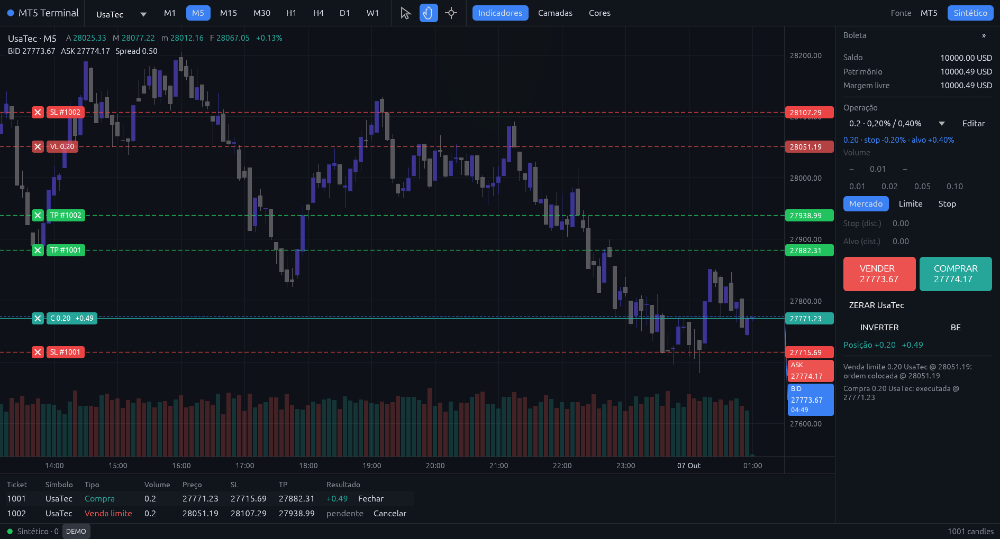
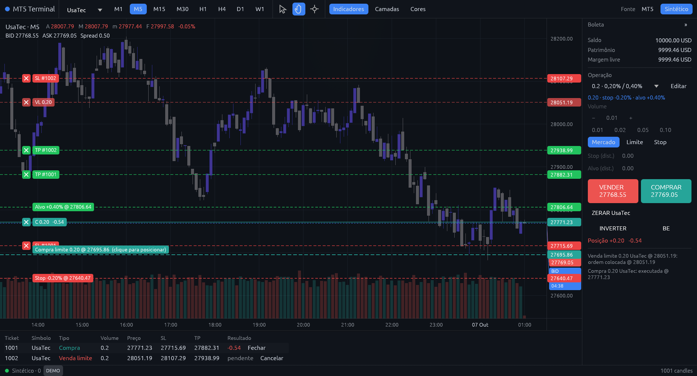
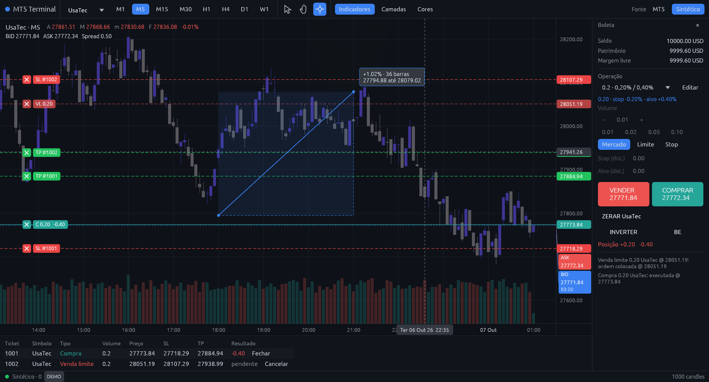
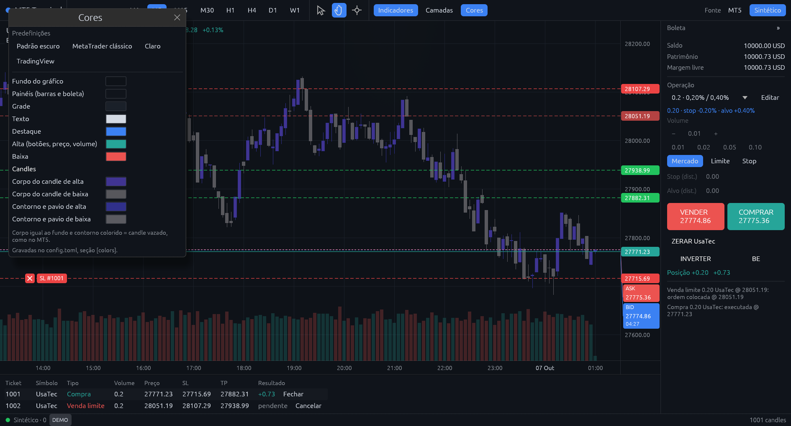

# MT5 Terminal

[](https://github.com/ReneMilare/mt5-terminal/actions/workflows/ci.yml)
[](https://github.com/ReneMilare/mt5-terminal/releases)
[](LICENSE)

**A fast, native charting and order terminal in Rust, with MetaTrader 5 as nothing more than the bridge to your broker.**

MetaTrader 5 keeps doing what it does well: talking to the broker. Charts, the order ticket and
chart trading live in a native app (egui + wgpu) that opens instantly, draws only what is on screen
and never drops a frame. An Expert Advisor (`mql5/TerminalBridge.mq5`) connects the two over local
TCP and relays quotes, history, positions and orders.



> The UI is in Brazilian Portuguese (*Comprar* = buy, *Vender* = sell, *Boleta* = order ticket).

## Highlights

- **Actually fast.** The first chunk of history paints in about a second; older bars stream in as you
  scroll back or zoom out. Indicators are incremental: a tick costs nanoseconds.
- **Chart trading, ProfitChart style.** Hold Shift to buy or Ctrl to sell and click to place; drag
  stops, targets and orders; the × on any line closes, cancels or removes it.
- **Order presets.** Volume, stop and target (as % of entry or in points) in one click, already drawn
  on the order that follows your pointer.
- **A full order ticket.** Market, limit and stop orders, flatten, reverse (netting and hedging),
  breakeven, and keyboard shortcuts.
- **Daily account result.** The ticket shows today's realized result including costs, current floating
  result and their total in account currency, across all symbols. The broker's server day determines
  the cutoff; deposits and withdrawals are excluded. The total stays in the status bar when the ticket
  is collapsed. Requires TerminalBridge v7; the Synthetic source uses UTC.
- **Safe by default.** Real accounts stay locked until you arm the ticket; your password stays in MT5;
  a **Synthetic** source with a simulated broker lets you try everything risk-free.
- **Configurable by you or by an AI agent.** Everything lives in a commented `config.toml`, applied
  live, plus a `ctl` command that never sends orders.

## Chart trading



- Hold **Shift** (buy) or **Ctrl** (sell): the order follows the pointer with the preset's volume,
  stop and target, and a click places it (limit on the favorable side, stop on the other).
- With **Alt** held, drag a position line toward profit (target) or loss (stop), or move orders,
  stops and targets already placed.
- To move an order, stop or target without **Alt**, click its label twice, keep the second click
  held and drag. You can also press and drag the label directly, without double-click timing.
  Both the left label and the price label on the right work, in all three cursor modes.
  The same gesture on a position creates a stop or target. Release to apply the new price.
- Stop and target labels show the estimated gross result in the account currency and the signed
  price change from entry (%), including while dragging. Hover for the calculation details.
- The **×** on each line (or Delete while hovering it) closes the position along with its stop and
  target, cancels the order, or removes just the stop/target. Right-click opens an order menu.
- Shortcuts: **Ctrl+Shift+B/S** buy/sell, **Z** flatten, **R** reverse, **E** breakeven, even with
  the ticket collapsed.

Every action goes through the same safety locks as the ticket.

## Charting



- Several symbols at once: the **Gráficos** menu shows 1, 2 side by side, 2 stacked, 3 side by side,
  2×2 or 3×2 charts, each with its own symbol, timeframe, indicators and date. The chart under the
  resting pointer, or the last one clicked (accent border), is the active one: the symbol/timeframe bar, the date bar, the ticket and the
  shortcuts apply to it; the others show their positions and orders read-only. Saved as
  `chart.layout` and `chart.charts`.
- Bid and ask lines with axis labels, spread in the legend, bar countdown.
- Three cursor modes: **Arrow**, **Hand** (drag the chart) and **Crosshair** (click and drag to
  measure the % change and the distance in bars; Esc clears).
- Keyboard: ←/→ pan, +/− zoom.
- **Escala automática** (above the chart) fits the price axis to the visible candles and stays on
  while panning. **Reenquadrar** recovers the candles and enables auto-scale, keeping the visible
  date and horizontal zoom. Dragging or scrolling the price axis switches to manual scale;
  double-clicking it restores auto-scale. The choice is saved as `chart.auto_scale` (default: true).
- Jump to a day: enter **DD/MM/YYYY** (or **YYYY-MM-DD**) in **Ir para data** and press Enter or
  **Ir**. Older history loads in chunks; dates use the chart's server time. A day without candles
  shows the next available session (or the nearest end of the available history). **Hoje** cancels
  a pending search, returns to the latest candles and resumes following the market, keeping the zoom.
- Price is drawn on top of everything by default; the layer order (levels, indicators, positions,
  price) is set in the **Camadas** (Layers) menu.
- More room when you need it: the ticket collapses to a thin strip (»/«) and the indicator pane
  minimizes.
- Switch between demo and real accounts from the status bar: the app restarts MT5 on the chosen
  account and asks for confirmation before going real.

## Colors



Like MT5's color tab: background, panels, grid, text, accent, up/down and candles (body and outline
set separately; a body matching the background gives hollow candles). Built-in presets (dark
default, classic MetaTrader, light, TradingView), applied instantly.

## Performance

Measured on a laptop (Hyprland, 1920×1080) with 20,000 bars and 20 ticks per second:

| | |
|---|---|
| Frame (UI) | ~0.8 ms average, p99 < 2 ms (60 Hz budget: 16.7 ms) |
| Idle | ~4% CPU, ~80 MB RAM |
| Tick without a new bar | ~180 ns in the indicators |
| New bar | ~0.25 ms |
| Full load of 20,000 bars | ~60 ms, off the UI thread |
| Startup to a live chart | ~0.4 s (MT5 already open); indicators warm in ~1 s |

Check it on your machine with `cargo test --release -- --ignored --nocapture bench`, or run the app
with `MT5_TERMINAL_PERF=1` to print frames/s, ticks/s and frame times every 5 s.

## Installation

### Download

Grab the latest Linux build from [Releases](https://github.com/ReneMilare/mt5-terminal/releases):

```sh
tar -xzf mt5-terminal-*-linux-x86_64.tar.gz
cd mt5-terminal-*-linux-x86_64
./mt5-terminal --synthetic   # try it without MT5: simulated data and broker
./mt5-terminal               # with MetaTrader 5 (starts it if it isn't running)
```

The archive also has a `.desktop` launcher and the EA source (`mql5/TerminalBridge.mq5`).

### Build from source

Requires Rust (edition 2024).

```sh
cargo build --release
target/release/mt5-terminal --synthetic
```

### Connect MetaTrader 5

MetaTrader 5 runs on Linux through Wine.

1. Compile and install the EA: `tools/build-ea.sh`, or open `mql5/TerminalBridge.mq5` in MetaEditor
   and compile it.
2. **Tools → Options → Expert Advisors**: allow WebRequest for `127.0.0.1`.
3. Attach `MT5Terminal/TerminalBridge` to any chart and turn on **Algo Trading**.

Only one instance runs at a time: launching it again brings the existing window to the front. Wire
protocol and details: [docs/protocol.md](docs/protocol.md).

## Configuration

`~/.config/mt5-terminal/config.toml`, commented and applied live on save (`mt5-terminal config init`
creates it, `config check` validates it). While the app is open, `mt5-terminal ctl help` lists
commands such as `ctl symbol UsaInd`, `ctl tf H1`, `ctl layout 4`, `ctl front price` and `ctl state`. AI agents
(Claude Code) get a skill in `.claude/skills/configure-mt5-terminal`. None of this sends orders.

## Indicators

The app ships no indicators of its own: an optional preset in `preset/` (a separate repository) is
compiled in when the folder exists, through the interface in [src/studies.rs](src/studies.rs).
Without it the app runs with a clean chart, as in the screenshots above. A preset can replace the
volume band (e.g. volume delta), mark a price per bar (e.g. POC) and add a pane under the chart.

The author's preset includes automatic Fibonacci on **M5, M15, H1 and D1**, feeding the confluences
of its support/resistance map. It uses the last swing between a high and a low confirmed by 2 closed
bars on each side, within the last 300 closed bars of each series. Default retracements: **23.6%,
38.2%, 50%, 61.8% and 78.6%**. Each label shows timeframe and percentage, aligned to the far left of
the chart; hovering shows every reference with its price. Several levels of the same Fibonacci count
as one reference in a confluence; different timeframes count separately. The map keeps up to three
levels on each side of the price, favoring confluences. Without a confirmed pivot pair, that series
waits. Settings under `[fibonacci]` in config.toml: `enabled`, `lookback` (20–2000), `pivot_bars`
(1–10) and `levels` (fractions from 0 to 1).

## Security

The bridge listens on `127.0.0.1` only. The app stores no credentials: you log in to the broker in
MT5. Use a demo account or the Synthetic source to test orders.

## License

[MIT](LICENSE)
